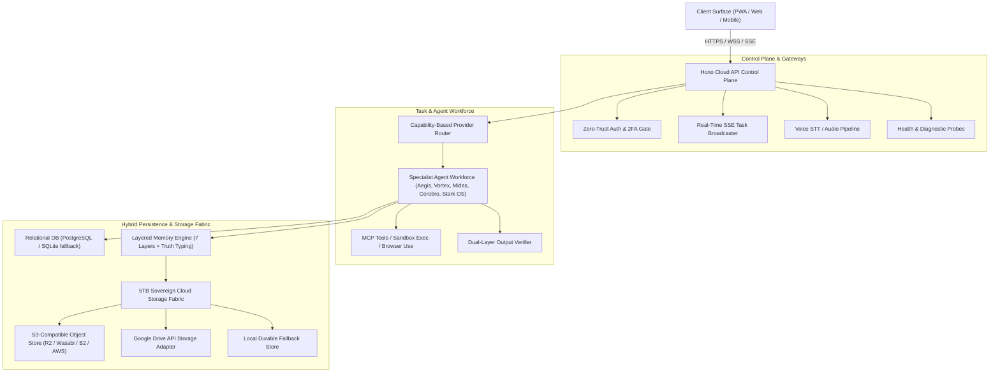

# J.A.R.V.I.S. — ACTUAL PRODUCTION ARCHITECTURE SPECIFICATION

**System**: Sri's J.A.R.V.I.S. Mark-V // Sovereign AI Business OS  
**Architecture Grade**: Production Resilient Cloud Operating System  
**Last Updated**: October 7, 2026  

---

## 1. High-Level Architectural Topology



---

## 2. Core Architectural Planes

### 2.1 Web & API Control Plane
- **Framework**: Hono v4 + `@hono/node-server` with ESBuild bundler (`server.mjs`).
- **Resilience**: Zero-Crash Sovereign Shield (`process.on('uncaughtException')` and `process.on('unhandledRejection')`).
- **Authentication**: Level-10 Master Sri Auth with server-side bcrypt (12 rounds), JWT sessions with unique `jti` nonces, TOTP 2FA (`otplib`), and local invite code enforcement.
- **Task Streaming**: Real-Time Server-Sent Events (`GET /api/tasks/stream`) broadcasting discrete progress events (`QUEUED`, `PLANNING`, `EXECUTING`, `VERIFYING`, `COMPLETED`, `FAILED`). Zero synthetic progress percentages.

### 2.2 5TB Storage Plane & High-Capacity Data Layer
The user's 5TB cloud storage acts strictly as the **large-object data plane**, NEVER as a transactional relational database.
- **Independent Interfaces**: `IStorageProvider`, `StorageMetadata`, `StorageHealth`.
- **Active Adapters**:
  - `S3StorageProvider`: SigV4 AWS S3 / Cloudflare R2 / MinIO / Backblaze B2 adapter.
  - `GoogleDriveStorageProvider`: OAuth2/REST Google Drive API adapter for 5TB personal cloud drives.
  - `LocalFallbackStorageProvider`: Directory-isolated, SHA-256 hashed atomic filesystem storage.
- **Partitioned Stores**:
  - `ObjectStore`: Datasets, model weights, research documents, video, audio recordings.
  - `ArtifactStore`: Execution traces, terminal output logs, browser recordings, file diffs.
  - `StorageMemoryStore`: Offloads memory payloads exceeding 4KB to maintain low database latency.
  - `BackupStore`: Point-in-time PostgreSQL dumps, disaster recovery snapshots.

### 2.3 Database Plane
- **Production Target**: Managed PostgreSQL (Render Starter Postgres or Supabase).
- **Driver**: Polymorphic Prisma 7 (`@prisma/adapter-pg` pool for PostgreSQL, `@prisma/adapter-libsql` for SQLite).
- **Automatic Migration**: `src/lib/db.ts` dynamically switches to PostgreSQL whenever `DATABASE_URL` starts with `postgres://` or `postgresql://`.
- **Data Protection**: Relational tables store transactional metadata, task definitions, auth sessions, and structured memory indices.

### 2.4 Model Provider Fabric & Capability Routing
- **Provider Registry**: Dynamic tracking of credentials, health status, latency, rate limits, and circuit breaker state.
- **Active Providers**:
  - **Gemini**: Primary provider for multimodal reasoning, coding, and fast latency (`gemini-1.5-flash`).
  - **Groq**: Ultra-low-latency Llama-3.3 fallback for quick tool calls.
  - **OpenRouter**: Secondary multi-model gateway for Claude 3.5 Sonnet / DeepSeek.
  - **Ollama**: Local workstation model runner (disabled in cloud environments).
- **Circuit Breakers**: Tracks consecutive failures per provider. Automatically trips to OPEN on 3 consecutive timeouts/429s and routes tasks to healthy fallback providers.

---

## 3. Specialist Agent Workforce

| Agent | Core Specialization | Authorized Tools | Model Policy | Verification Policy |
| :--- | :--- | :--- | :--- | :--- |
| **Aegis** | Cyber Threat Defense & Security Audit | Port scan, JWT audit, log inspector, threat scanner | Low temperature, high-determinism | Strict cryptographic validation |
| **Vortex** | Full-Stack Engineering & Code Synthesis | File edit, bash exec, git, linting, build runner | Code-specialized LLM | Compilation & test run evidence |
| **Midas** | Revenue Intelligence & Arbitrage | Market scraper, pricing analyst, opportunity scout | Analytical reasoning | Math & source link verification |
| **Cerebro** | Deep Research, RAG & Semantic Memory | Vector search, document parser, citation builder | High-context RAG LLM | Fact check against primary sources |
| **Stark OS** | Autonomous Orchestration & Scheduler | Multi-agent dispatch, mission planner, health monitor | Fast router model | State transition verification |

---

## 4. Rigorous Task Execution Lifecycle

Every task follows a strict 10-stage execution pipeline:

$$\text{PLAN} \longrightarrow \text{ROUTE} \longrightarrow \text{EXECUTE} \longrightarrow \text{OBSERVE} \longrightarrow \text{VERIFY} \longrightarrow \text{RECOVER} \longrightarrow \text{REVERIFY} \longrightarrow \text{REPORT} \longrightarrow \text{STORE EVIDENCE} \longrightarrow \text{LEARN}$$

1. **PLAN**: Task decomposed into verifiable discrete operations.
2. **ROUTE**: Agent and model chosen based on capability and health.
3. **EXECUTE**: Actual tool invoked in isolated environment.
4. **OBSERVE**: Tool output captured in full (no truncated placeholders).
5. **VERIFY**: Output compared against objective criteria.
6. **RECOVER**: On failure, diagnose error, retrieve known fix from `MemoryStore`, patch and retry.
7. **REVERIFY**: Verify that retry resolves failure.
8. **REPORT**: Detailed execution report generated.
9. **STORE EVIDENCE**: Raw output and diff saved to `ArtifactStore`.
10. **LEARN**: New failure signature and working fix recorded to `SKILL`/`FAILURE` memory plane.

---

## 5. Voice Pipeline Specification

```
Microphone Hardware
  └── Echo Cancellation & Noise Suppression (Web Audio API)
       └── Voice Activity Detection (Silero VAD / Energy Boundary)
            └── Audio Capture (WAV / PCM 16kHz)
                 └── Multimodal Cascade STT (POST /api/voice/transcribe)
                      └── Intent & Command Parser
                           └── J.A.R.V.I.S. Agent Execution
                                └── TTS Audio Playback (MIC MUTED DURING TTS PLAYBACK)
```

- **Mute During TTS Rule**: When speech synthesis is active, microphone input is strictly disconnected in `JarvisVoiceModal.tsx` to prevent audio feedback loops and self-transcription.
- **Physical Voice Gate**: Headless environments cannot test physical acoustics; physical tests are clearly flagged as `NOT_RUNTIME_VERIFIED` until tested with human speech.

---

## 6. Self-Healing & Sandboxed Rollback

- **Constraint**: Production self-modification is strictly sandboxed. Uncontrolled hot-patching of production code is prohibited.
- **Workflow**:
  1. Detect runtime error via `CrashRecovery` or test failure.
  2. Fork isolated workspace in temporary directory.
  3. Apply remediation patch.
  4. Run automated test suite (`tests/`).
  5. Verify zero regression.
  6. Atomic swap / commit with rollback pointer.
