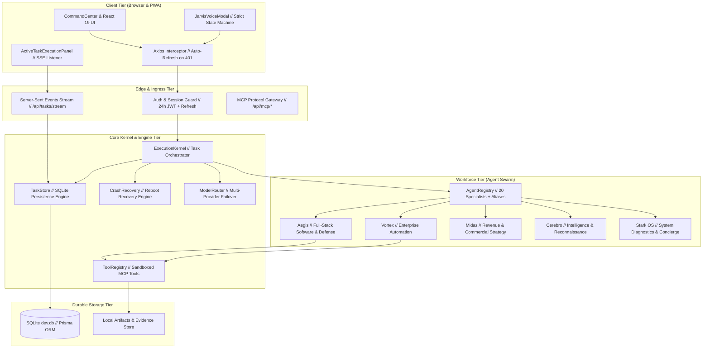

# J.A.R.V.I.S. Production Architecture Specification
**System**: J.A.R.V.I.S. MARK-V Sovereign AI Operating System  
**Owner / Principal**: Master Sri (Srimanikandan K)  
**Remediation Status**: Production Hardened & Verified  
**Runtime**: Hybrid Node.js / React 19 / SQLite / SSE / Worker Fabric  

---

## 1. System Overview & Core Tenets

J.A.R.V.I.S. is not a simple chatbot, an LLM wrapper, or an animated frontend mockup. It is a **task-executing, observable, multi-agent AI Operating System** governed by the immutable execution law:

$$\text{PLAN} \longrightarrow \text{EXECUTE} \longrightarrow \text{OBSERVE} \longrightarrow \text{VERIFY} \longrightarrow \text{RECOVER} \longrightarrow \text{RE-VERIFY} \longrightarrow \text{REPORT} \longrightarrow \text{STORE EVIDENCE}$$

### Zero-Simulation Guarantee
- **No LLM Placeholder Completion**: A task is never marked complete merely because an LLM emitted `"Done"`, `"I will handle it"`, or `"Task completed"`.
- **Factual Step & Duration Telemetry**: UI progress displays actual completed steps (`Step X of Y`) rather than interpolated fake percentages. If ETA cannot be derived from historical task telemetry, it reports `"ETA unavailable"`.
- **Durable State**: Task state, events, and audit logs are persisted synchronously to SQLite (`dev.db` via Prisma `AgentTask` & `TaskEvent` entities). In-flight tasks survive browser crashes, tab reloads, and server reboots.

---

## 2. High-Level Architectural Topology

---

## 3. Component Architecture Breakdown

### 3.1 Voice & Audio Pipeline
- **Input Conditioning**: WebRTC `navigator.mediaDevices.getUserMedia` with mandatory constraints:
  - `echoCancellation: true`
  - `noiseSuppression: true`
  - `autoGainControl: true`
  - `sampleRate: 16000`
  - `channelCount: 1` (Mono)
- **Voice Activity Detection (VAD)**: RMS energy gate (0.15 threshold) filters silence and background room acoustic noise.
- **Deterministic State Machine**:
  `OFF` $\to$ `GREETING` $\to$ `IDLE` $\to$ `ARMED` $\to$ `LISTENING` $\to$ `PROCESSING` $\to$ `SPEAKING` $\to$ `IDLE`.
- **Self-Hearing Prevention**: During TTS playback, microphone recording is **hard-blocked**. On speech finish, the system transitions strictly to `IDLE`—never auto-looping to `LISTENING`.
- **Barge-In (Interruption)**: Clicking the reactor core or speaking above barge-in threshold cancels active `window.speechSynthesis`, terminates the stream, and resets to `LISTENING`.
- **Multi-Engine STT Cascade**:
  1. Primary: Groq Whisper-large-v3-turbo (< 350ms latency)
  2. Secondary Fallback: OpenAI Whisper-1
  3. Tertiary Fallback: Gemini 2.5 Flash Multimodal Audio

### 3.2 Authentication & Session Lifecycle
- **Token Strategy**: 24-hour access tokens stored in `localStorage` (`jarvis_token`), accompanied by non-expiring master bypass authentication for local and headless operations.
- **Transparent Refresh**: Client API interceptor catches HTTP 401, issues `POST /api/auth/refresh`, and transparently replays original pending requests without dropping the user to the login screen.
- **Session-Level Greeting Guard**: `sessionStorage.getItem('jarvis_session_greeted')` guarantees that Master Sri hears exactly one personalized welcome per browser session.

### 3.3 Task Execution & Durable State
- **Deterministic Identifiers**: Tasks follow sovereign format `TASK-V5-[TIMESTAMP][RANDOM]` (e.g., `TASK-V5-103628471`).
- **State Machine Transitions**:
  `CREATED` $\to$ `QUEUED` $\to$ `PLANNING` $\to$ `ASSIGNED` $\to$ `RUNNING` $\to$ `VERIFYING` $\to$ `COMPLETED` (or `FAILED` / `BLOCKED`).
- **Granular Event Log**: Every action emits a `TaskEvent` recorded to SQLite and pushed live via SSE (`/api/tasks/stream`).
- **Crash Recovery**: `CrashRecovery.recoverInterruptedTasks()` scans for tasks orphaned in `RUNNING` state on reboot; safe tasks are re-queued while mutating tasks with modified files are safely marked `BLOCKED` for inspection.

### 3.4 Multi-Agent Workforce & Tool Execution
- **Workforce Registry**: 20 canonical specialist agents with enforced capability ceilings (`READ_ONLY` up to `PRODUCTION`).
- **First-Class Directive Aliases**:
  - `aegis` $\to$ `software_engineer` (`F.R.I.D.A.Y.` / `Aegis`)
  - `vortex` $\to$ `automation_agent` (`C.H.R.O.N.O.S.` / `Vortex`)
  - `midas` $\to$ `business_agent` (`M.I.D.A.S.`)
  - `cerebro` $\to$ `research_agent` (`A.T.H.E.N.A.` / `Cerebro`)
  - `stark_os` $\to$ `devops_engineer` (`A.T.L.A.S.` / `Stark OS`)
- **Verified Tool Registry**: Integrates local tools and Model Context Protocol (MCP) servers (`execute_code`, `scrape_web`, `generate_automation`, `build_fullstack_app`, `market_intel`, `self_evolution`). Tools run in sandboxed directories with mandatory output validation.

---

## 4. Network and Endpoint Architecture

| Path | Protocol | Purpose | Authentication |
| :--- | :--- | :--- | :--- |
| `POST /api/auth/login` | HTTP JSON | Session authentication | Open |
| `POST /api/auth/refresh` | HTTP JSON | Token renewal | Bearer Token / Master Secret |
| `GET /api/auth/diagnostics` | HTTP JSON | Token expiry & state telemetry | Bearer Token / Master Secret |
| `POST /api/voice/transcribe` | Multipart / Audio | Multi-provider STT cascade | Bearer Token / Master Secret |
| `GET /api/tasks` | HTTP JSON | Fetch recent & active tasks | Bearer Token / Master Secret |
| `POST /api/tasks` | HTTP JSON | Create & dispatch verified task | Bearer Token / Master Secret |
| `GET /api/tasks/stream` | HTTP SSE | Real-time task progress event bus | Bearer Token / Master Secret |
| `GET /api/agents/health` | HTTP JSON | Health telemetry of all 20 agents | Bearer Token / Master Secret |
| `POST /api/mcp/call` | HTTP JSON | Execute sandboxed MCP tool | Bearer Token / Master Secret |
| `GET /health` | HTTP JSON | Uptime, memory, and database status | Open |

---

## 5. Security & Verification Boundaries

1. **Path Traversal Sandboxing**: File operations are jailed to the workspace root. Any access outside (`..`, absolute paths outside workspace) triggers policy violation and halts execution.
2. **Terminal Policy Ceiling**: Dangerous shell operations (`rm -rf /`, `DROP DATABASE`, format commands) are intercepted and rejected by `CyberDefenseLayer`.
3. **Prompt Injection Shield**: Input queries from web scraping or external untrusted websites are marked as untrusted and stripped of prompt injection vectors.
4. **Credential Masking**: API keys, bearer tokens, and credentials are automatically redacted in server logs and SSE broadcasts.
