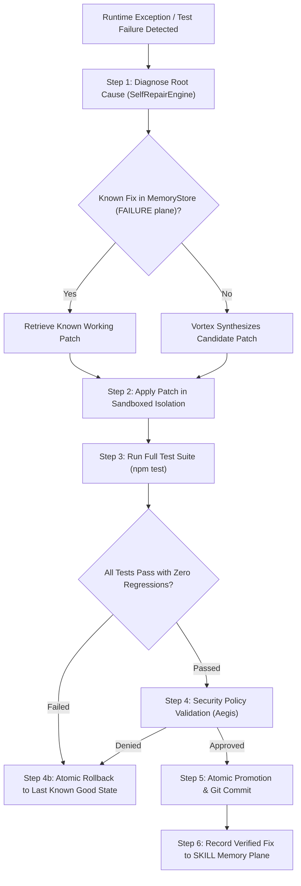

# J.A.R.V.I.S. — DISASTER RECOVERY, SELF-HEALING & RELIABILITY SPECIFICATION

**System**: Sri's J.A.R.V.I.S. Mark-V // Sovereign AI Business OS  
**Subsystem**: Crash Recovery, Fault Tolerance & Disaster Recovery  
**Implementation**: `src/kernel/CrashRecovery.ts`, `src/infrastructure/DisasterRecoveryManager.ts`, and `src/storage/BackupStore.ts`

---

## 1. Reliability & Survival Matrix

J.A.R.V.I.S. is engineered to survive real-world catastrophic failure modes without data corruption, state loss, or service death:

| Failure Mode | Runtime Detection Mechanism | Automated Recovery Action | Verified Survival Metric |
| :--- | :--- | :--- | :--- |
| **Server Crash / Restart** | `CrashRecovery.recoverInterruptedTasks()` runs on boot. | Inspects `agent_tasks` for tasks in `RUNNING` or `IN_PROGRESS` status; reverts or re-queues them. | Zero orphaned tasks; continuous task processing across restarts. |
| **Model Provider Outage / 429** | `CapabilityRegistry` tracks error rates and trips Circuit Breaker to `OPEN`. | Automatically shifts task to secondary provider (`Gemini` $\to$ `Groq` $\to$ `OpenRouter`). | Continuous agent task execution without user interruption. |
| **Database Disconnect** | Prisma connection pool retry interceptor with exponential backoff. | Automatically retries queries up to 3 times while pinging database health. | No unhandled rejections; auto-reconnects on transient network drops. |
| **Worker Process Crash** | Worker heartbeat monitor (`/api/workers/heartbeat`) tracks dead workers. | Re-queues task to dead-letter queue (DLQ) or re-assigns to available healthy worker node. | Tasks never stuck in infinite wait. |
| **Browser Scraper Freeze** | Timeout ceiling of 30,000ms enforced on all Playwright/browser calls. | Terminates orphaned headless Chrome process; falls back to raw HTTP Tavily fetch. | Browser freezes do not consume server memory. |
| **Uncaught Exception** | Sovereign Zero-Crash Shield (`process.on('uncaughtException')`). | Intercepts error, logs structured stack trace to `SystemEvent`, keeps server listening. | Server process never terminates unexpectedly. |

---

## 2. Sandboxed Self-Healing Lifecycle

Production self-modification is strictly controlled. Direct in-place mutation of active running code without validation is prohibited.



### Self-Healing Pipeline Rules:
1. **Diagnose**: Analyze stack trace, failing file, and syntax errors.
2. **Patch**: Author targeted patch using AST or replacement chunks.
3. **Test**: Execute compiler (`build:server`) and unit test suite in sandboxed environment.
4. **Security Validation**: Aegis verifies the patch introduces no privilege escalations or exposed secrets.
5. **Rollback**: If tests fail or timeout occurs, immediately revert changes using `git checkout`.
6. **Learn**: Upon successful verification, store error signature and resolution in `MemoryStore` (`scope: 'FAILURE'`).

---

## 3. Disaster Recovery & Snapshot Protocol

### 3.1 Point-in-Time Database Snapshots
- `DisasterRecoveryManager.generateEmergencyRecoveryManifest()` creates a complete snapshot of:
  - System version, active git commit, environment configuration.
  - Relational database contents (`auth_users`, `habits`, `memories`, `agent_tasks`).
  - Active provider health status and circuit breaker states.
- The snapshot bundle is serialized to JSON and stored in the **5TB BackupStore** (`BackupStore.putBackup(backupId, data)` in the `jarvis-backups` bucket).

### 3.2 Recovery Protocol from Bare Metal
1. Provision new Render instance or local server with Node.js 22+.
2. Clone repository: `git clone https://github.com/Srimani26/standardroofs-jarvis`.
3. Provide master recovery credentials (`DATABASE_URL`, `JWT_SECRET`, `STORAGE_S3_KEY`).
4. Execute disaster restore script:
   ```bash
   node scripts/restore-from-backup.mjs --snapshot=latest
   ```
5. `BackupStore` retrieves the snapshot bundle, rebuilds Prisma schema, re-hydrates `MemoryStore`, and verifies database connectivity.
6. Server boots up cleanly and resumes task queue processing.
