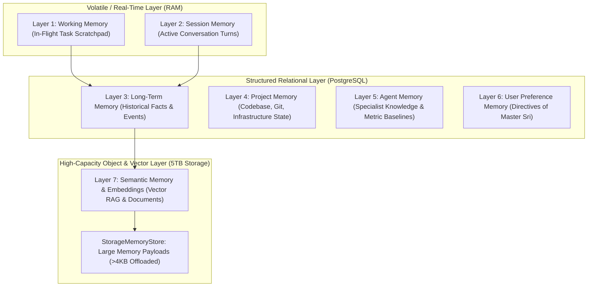

# J.A.R.V.I.S. — LAYERED MEMORY ARCHITECTURE & EPISTEMIC DISCRIMINATION

**System**: Sri's J.A.R.V.I.S. Mark-V // Sovereign AI Business OS  
**Subsystem**: Scoped Layered Memory & Personal Knowledge Engine  
**Implementation**: `src/memory/LayeredMemoryEngine.ts` and `src/storage/StorageMemoryStore.ts`

---

## 1. Architectural Philosophy: Epistemic Ground Truth

A personal operating system must never conflate what it **knows** with what it **guesses** or what was merely **mentioned in conversation**. 

J.A.R.V.I.S. enforces a strict 5-tier Epistemic Classification for every memory:

```
[INPUT / PERCEPTION]
       │
       ├── Explicit User Instruction? ──────> USER_PREFERENCE (Confidence: 1.0)
       ├── Empirically Verified by Tool/Test? ──> FACT (Confidence: 1.0, Signed Provenance)
       ├── Probabilistic Model Output? ──────> INFERENCE (Confidence: 0.1 - 0.9, Model Tagged)
       ├── In-Flight Scratchpad / Plan? ─────> TEMPORARY_CONTEXT (TTL Expiration Attached)
       └── External Raw Unverified Data? ────> UNVERIFIED_INFORMATION (Quarantined)
```

### 1.1 Epistemic Truth Types

| Truth Type | Definition | Verification Standard | Retention / Mutation |
| :--- | :--- | :--- | :--- |
| `FACT` | Empirically validated ground truth (e.g. database schema, verified compiler output, active commit SHA). | Requires cryptographic or tool execution evidence signature. | Permanent; updated only through empirical invalidation. |
| `INFERENCE` | Probabilistic hypothesis deduced by an LLM or reasoning engine. | Must have explicit confidence score (0.0 - 0.99) and originating model ID. | Subject to revision or promotion to `FACT` upon empirical testing. |
| `USER_PREFERENCE` | Direct directive, habit, or operational parameter set by Master Sri. | Originates from authenticated Master Sri session (`Level-10 Auth`). | Highest operational priority; overrides default heuristics. |
| `TEMPORARY_CONTEXT`| Scratchpad state, intermediate tool outputs, or active execution variables. | Scoped to active task or session; bounded by TTL. | Automatically purged upon task termination or TTL expiration. |
| `UNVERIFIED_INFORMATION` | Unchecked web search snippets, user chat claims before verification, third-party webhook payloads. | Uncorroborated external data. | Quarantined; agents cannot execute irreversible actions based on this. |

---

## 2. Seven-Layer Memory Plane Hierarchy



### 2.1 Layer Definitions
1. **Working Memory (`WORKING`)**: Volatile scratchpad associated with a specific `taskId`. Stores intermediate bash outputs, AST diffs, and execution thoughts. Wiped cleanly when task achieves `COMPLETED` or `FAILED`.
2. **Session Memory (`SESSION`)**: Thread and turn-level interactions between Master Sri and J.A.R.V.I.S. Contains dialog context and active topic anchors.
3. **Long-Term Memory (`LONG_TERM`)**: Persistent historical knowledge spanning restarts and reboots. Stored in PostgreSQL with unique content hashes.
4. **Semantic Memory (`SEMANTIC`)**: High-dimensional vector-embedded representations for RAG document retrieval, personal knowledge bases, and document semantic search.
5. **Project Memory (`PROJECT`)**: Specific architectural decisions, dependency matrices, active branches, deployment targets, and directory topology for `Srimani26/standardroofs-jarvis`.
6. **Agent Memory (`AGENT`)**: Specialist agent domain knowledge. Tracks tool success rates, preferred prompt strategies, and failure avoidance rules per agent (Aegis, Vortex, Midas, Cerebro, Stark OS).
7. **User Preference Memory (`USER_PREFERENCE`)**: Explicit rules, preferences, security policies, and daily habits dictated by Master Sri.

---

## 3. Storage Tiering & Hybrid Architecture

To preserve database performance and avoid bloating the relational database:

1. **Relational PostgreSQL (`prisma.memory`)**:
   - Stores indexing metadata: `id`, `category` (Scope), `tags` (`TruthType,Source`), `importance` (Confidence score), `createdAt`, `updatedAt`.
   - JSON-serialized metadata: `key`, `truthType`, `confidence`, `permissions`, `provenance`, `expiresAt`, `artifactKey`.
2. **5TB Cloud Storage (`StorageMemoryStore` in `jarvis-memories` bucket)**:
   - Any memory payload or transcript exceeding **4,096 bytes** is automatically offloaded to the 5TB object store.
   - The database stores a reference pointer: `artifactKey = records/{memoryId}.json`.
   - `LayeredMemoryEngine.getFullContent()` transparently hydrates offloaded payloads on demand.

---

## 4. Cryptographic Provenance & Chain of Custody

Every memory record implements the `MemoryProvenance` interface:
```typescript
export interface MemoryProvenance {
  creator: string;              // Agent or user who created the record
  verifiedBy?: string;          // Verifying agent or human supervisor
  verifiedAt?: string;          // ISO timestamp of empirical verification
  chainOfCustody: string[];     // Full mutation history array
  originalSourceUri?: string;   // URL, file path, or task ID origin
}
```

### Verified Promotion Workflow:
When an agent forms an `INFERENCE` (e.g. *"Llama-3.3-70b is faster than Gemini on this endpoint"*), it remains an inference. Only when Vortex or Cerebro benchmarks the endpoint and proves the claim does `LayeredMemoryEngine.verifyMemory(memoryId, verifier)` execute, promoting it to `FACT` and appending the verifier to the `chainOfCustody`.
