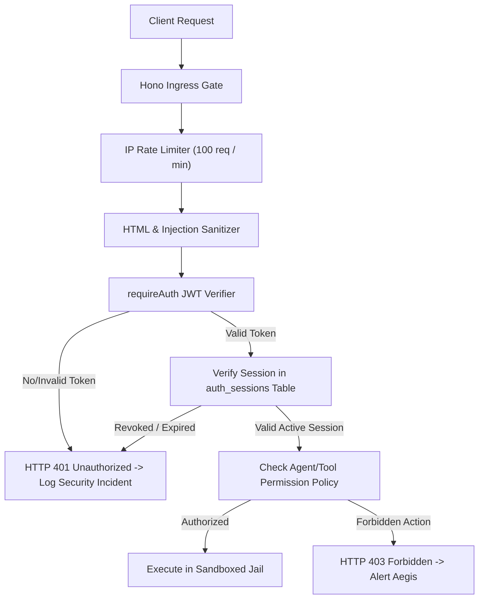

# J.A.R.V.I.S. — ZERO-TRUST SECURITY MODEL & POLICY ENFORCEMENT

**System**: Sri's J.A.R.V.I.S. Mark-V // Sovereign AI Business OS  
**Security Standard**: Sovereign Zero-Trust Boundary & Level-10 Master Sri Auth  
**Implementation**: `custom-routes.ts`, `src/surfaces/CyberThreatDefense.tsx`, and `src/security/`

---

## 1. Zero-Trust Security Invariants

1. **Absolute Secret Isolation**: Under zero circumstances are `JWT_SECRET`, database passwords, or provider API keys transmitted to client browsers, logged in plain text, or serialized into database task output logs.
2. **Mandatory Least-Privilege**: Every agent and tool operates within a hard policy ceiling. No tool receives blanket root permissions.
3. **No Unauthenticated Execution**: All mutation and task execution endpoints require a valid Level-10 Master Sri JWT session token and verified origin headers.
4. **Sandboxed Filesystem Jail**: All file modification operations are strictly jailed to the application workspace directory. Directory traversal (`../`) is blocked with immediate security alerts.

---

## 2. Authentication & Authorization Architecture



### 2.1 Credential & Key Safeguards
- **Password Hashing**: Bcrypt with 12 computational rounds (`BCRYPT_ROUNDS = 12`).
- **Two-Factor Authentication (2FA)**: Time-based One-Time Password (TOTP) algorithm using RFC 6238 standards (`otplib`), verifiable via Google Authenticator or hardware tokens.
- **Session JTI Nonces**: Every JWT generated contains a 128-bit cryptographically secure random `jti` nonce (`randomBytes(16).toString('hex')`) preventing identical-token replay attacks.
- **Invite Code Gateway**: Sign-up is protected by a locally generated 12-character high-entropy invite code stored in `.jarvis-invite`. Public self-registration is impossible without this code.

---

## 3. Sandboxing & Runtime Defenses

### 3.1 Filesystem Jail Policy
All file operations in `src/lib/task-engine.ts` and `src/storage/adapters/` pass through canonical path resolution:
```typescript
function assertPathWithinJail(targetPath: string, rootDir: string): void {
  const resolved = path.resolve(rootDir, targetPath);
  if (!resolved.startsWith(path.resolve(rootDir))) {
    throw new SecurityException(`Path traversal blocked: ${targetPath} attempts to escape jail ${rootDir}`);
  }
}
```

### 3.2 Command Execution Ceiling
Destructive and escape commands are strictly blocked by the Aegis Policy Ceiling:
- **Blocked Commands**: `rm -rf /`, `mkfs`, `dd if=/dev`, `chmod 777 /`, `nc -e`, `iptables -F`, `shutdown`, `reboot`.
- **Allowed Scope**: Read-only directory listings, isolated git operations, `npm test`, `npm run build:server`, and local file edits.

### 3.3 Server-Side Request Forgery (SSRF) Protection
When the BrowserUseScraper or RAG pipeline fetches external URLs:
- Resolves DNS before fetching.
- Blocks internal cloud metadata endpoints: `169.254.169.254` (AWS/GCP metadata), `10.0.0.0/8`, `172.16.0.0/12`, `192.168.0.0/16`, and `127.0.0.1`.
- Enforces strict protocol whitelist: only `http:` and `https:`.

### 3.4 Prompt Injection & Evasion Defenses
- Incoming user and webhook text is sanitized to strip executable script tags and null bytes.
- Agent system prompts contain immutable Sovereign Identity Anchors that instruct models to reject adversarial instructions attempting to bypass security boundaries or leak memory records.

---

## 4. Audit Logging & Real-Time Security Telemetry

Every security event, failed login attempt, path violation, and token refresh is recorded in the `ActivityLog` and `SystemEvent` tables:
- `timestamp`: UTC ISO 8601 string.
- `surface`: Originating route or UI view (`CyberThreatDefense`, `Auth`, `TaskEngine`).
- `level`: `info`, `warn`, `error`, `critical`.
- `action`: Specific security event code (`LOGIN_SUCCESS`, `INVALID_2FA`, `BLOCKED_TRAVERSAL`, `PROVIDER_CIRCUIT_TRIP`).
- `details`: Sanitized metadata (IP address, user agent, target resource).
