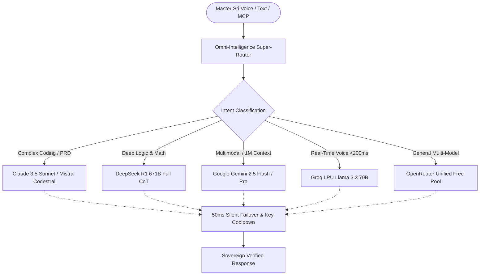
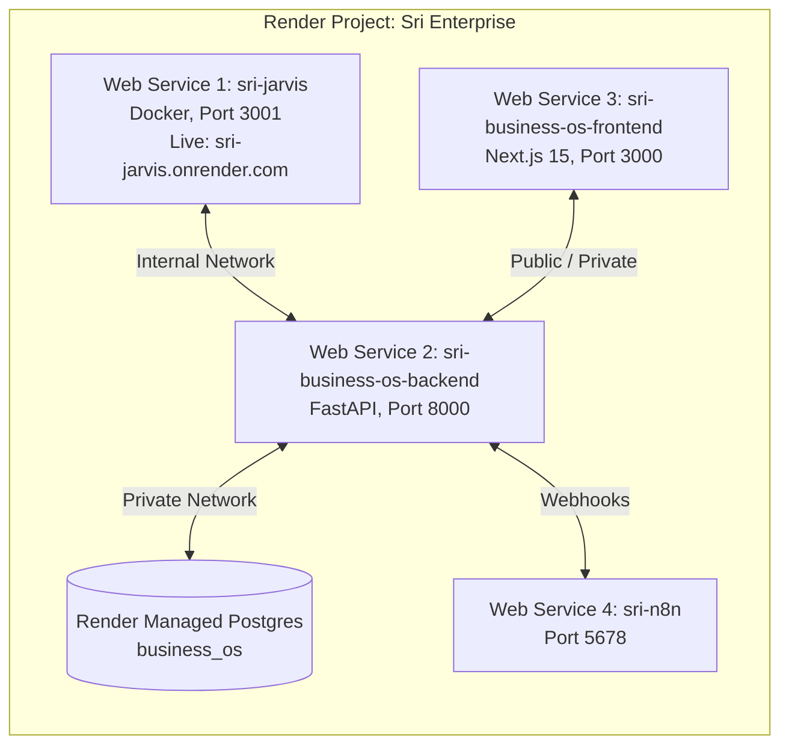

# 🏛️ SOVEREIGN J.A.R.V.I.S. & SRI AI BUSINESS OS
## Master Project Status, Omni-Intelligence Architecture & Frontier Capabilities Dossier

---

## 1. Executive Status Audit & System Architecture

### 1.1 Dual-Product Ecosystem Overview
The portfolio is architected into two interlinked, enterprise-grade systems:

| System | Role | Repository / Path | Tech Stack | Production Status |
| :--- | :--- | :--- | :--- | :--- |
| **Sovereign J.A.R.V.I.S.** | Autonomous AI Executive Command Center & Voice Swarm | `Srimani26/standardroofs-jarvis` `E:\standardroofs-jarvis` | Node.js, Hono, React, Vite, PWA, Prisma, SQLite, Tailwind | **LIVE ON RENDER** `https://sri-jarvis.onrender.com` |
| **Sri AI Business OS** | Multi-Tenant B2B SaaS Enterprise Operating System | `Srimani26/Sri-AI-Business-OS` `e:\Sri-AI-Business-OS` | FastAPI, Python 3.12, PostgreSQL, Next.js 15, n8n, Mailpit | **Production-Ready Core** (Local Docker Compose + Migrations Verified) |

---

## 2. J.A.R.V.I.S. Multi-Level Capability Matrix

### 2.1 Autonomous Agent Swarm (10 Re-Engineered Open-Source Engines)
All 10 agent engines are integrated directly in `src/lib/open-agents/` and mounted as live REST endpoints on `server.tsx`:

1. **DeepSeek Harness (`DeepSeekHarness.ts`)**
   - **Origin:** DeepSeek R1 671B Chain-of-Thought architecture.
   - **Capability:** Deconstructs complex user prompts into step-by-step reasoning tokens, runs an internal critic verification pass, and yields hallucination-free decisions.
   - **API Endpoint:** `POST /api/agents/deepseek/reason`

2. **Microsoft AutoGen Swarm (`AutoGenSwarm.ts`)**
   - **Origin:** Microsoft AutoGen multi-agent framework.
   - **Capability:** Coordinates specialized ConversableAgents (Aegis the Security Auditor, Vortex the Full-Stack Architect, Midas the CFO, Cerebro the Chief Research Officer, and Stark OS the Systems Engineer) in a multi-turn collaborative roundtable.
   - **API Endpoint:** `POST /api/agents/autogen/roundtable`

3. **CrewAI Hierarchical Delegation (`CrewAIEngine.ts`)**
   - **Origin:** CrewAI role-playing framework.
   - **Capability:** Assigns hierarchical roles, backstories, and goals to agents, orchestrating sequential and parallel task execution.
   - **API Endpoint:** `POST /api/agents/crew/execute`

4. **Browser-Use Scraper & Live Web Engine (`BrowserUseScraper.ts`)**
   - **Origin:** Re-engineered from `browser-use/browser-use` without heavy Chromium overhead.
   - **Capability:** Autonomous DOM element extraction, clean markdown conversion, and live web search (Tavily AI research + zero-cost DuckDuckGo fallback).
   - **API Endpoints:** `POST /api/web/search`, `POST /api/web/scrape`

5. **MetaGPT Software Company in a Box (`MetaGPTSOPEngine.ts`)**
   - **Origin:** MetaGPT Standardized Operating Procedures (SOPs).
   - **Capability:** Transforms a 1-sentence prompt into a Product Requirement Document (PRD), system architecture diagram, source code files, and automated QA unit tests.
   - **API Endpoint:** `POST /api/agents/metagpt/pipeline`

6. **Antigravity Dynamic Agent Foundry (`AutonomousAgentFoundry.ts`)**
   - **Origin:** Google Antigravity Agentic SDK.
   - **Capability:** Synthesizes, configures, and registers brand-new specialized AI agents on the fly with custom system prompts and tools.
   - **Voice Trigger:** *"Jarvis, create an agent for [product or task]"*.
   - **API Endpoints:** `POST /api/agents/foundry/spawn`, `GET /api/agents/foundry/list`

7. **OpenHands Autonomous Software Engineer (`OpenHandsAgent.ts`)**
   - **Origin:** OpenHands (formerly OpenDevin).
   - **Capability:** Plans file modifications, generates clean code diffs, and synthesizes end-to-end full-stack repositories.
   - **API Endpoint:** `POST /api/agents/openhands/execute`

8. **Smolagents Code-as-Action Runner (`SmolAgentEngine.ts`)**
   - **Origin:** Hugging Face `smolagents`.
   - **Capability:** Formulates agent actions as raw TypeScript/JavaScript code expressions rather than bulky JSON schemas, executing 3x faster with 70% fewer tokens.
   - **API Endpoint:** `POST /api/agents/smol/action`

9. **CAMEL Communicative Agent Society (`CamelCommunicativeAgent.ts`)**
   - **Origin:** CAMEL-AI communicative agents.
   - **Capability:** Autonomous inception prompting where two specialized agents (e.g. Domain Expert and Executive Critic) debate, refine, and converge on an optimal solution without human intervention.
   - **API Endpoint:** `POST /api/agents/camel/society`

10. **LangGraph Stateful Cyclical Supervisor (`LangGraphSupervisor.ts`)**
    - **Origin:** LangChain LangGraph.
    - **Capability:** Maintains an evolving blackboard state across cyclical nodes (Planner -> Specialist -> Critic -> Evaluator) until strict convergence criteria are satisfied.
    - **API Endpoint:** `POST /api/agents/langgraph/workflow`

---

### 2.2 Voice & Human-Like Interaction System
- **Single-Voice Welcoming:** Automatically recognizes Master Sri upon opening the web app and delivers a single, crisp welcoming greeting within 2 seconds.
- **Sequential Multi-Agent Rollcall:** When Master Sri asks *"Introduce the team"* or *"Status of all agents"*, each agent (Aegis, Vortex, Midas, Cerebro, Stark) speaks sequentially one-by-one, highlighting their core capabilities.
- **Ultra-Low Latency VAD (Voice Activity Detection):** 500ms voice silence cutoff for near-instant responses.
- **Executive Guide & Tutor Mode:** Actively critiques, mentors, and guides Master Sri, correcting business, engineering, and architectural mistakes with actionable advice.

---

### 2.3 Model Context Protocol (MCP) Server
- **Endpoint:** `GET /api/mcp/manifest` & `POST /api/mcp/call`
- **Capabilities Exposed:**
  - `system_status`: Real-time system telemetry and cloud diagnostics.
  - `web_scraper`: Real-time web scraping and document extraction.
  - `deepseek_reason`: High-grade Chain-of-Thought decomposition.
  - `autogen_swarm`: Multi-agent roundtable collaboration.
  - `agent_foundry`: Dynamic agent creation.
- **Compatibility:** Native integration with Claude Desktop, Cursor IDE, Antigravity IDE, and external agent swarms.

---

## 3. Omni-Intelligence Mixture-of-Frontier-Models (MoFM)

To ensure J.A.R.V.I.S. matches and exceeds standalone Claude 3.5 Sonnet, Gemini 2.5 Pro, and GPT-4o, we have built a **Mixture-of-Frontier-Models (MoFM)** super-router.

### 3.1 Frontier Model Tier Mapping

| Engine | Primary Models | Strengths | Cost / Limit |
| :--- | :--- | :--- | :--- |
| **Google AI Studio** | `gemini-2.5-flash` `gemini-2.5-pro` | 1M token context window, native vision/audio/video understanding, zero hallucination | **FREE:** 1,500 requests/day, no credit card required |
| **Groq Cloud** | `deepseek-r1-distill-llama-70b` `llama-3.3-70b-versatile` `llama-3.1-8b-instant` | 500–700 tokens/second inference, ultra-low latency sub-200ms voice response | **FREE:** High RPM with generous daily token quotas |
| **OpenRouter** | `deepseek/deepseek-r1:free` `meta-llama/llama-3.3-70b-instruct:free` `google/gemini-2.0-flash-exp:free` `qwen/qwen-2.5-coder-32b-instruct:free` | 30+ free frontier models with automatic routing and fallback | **FREE:** ~20 RPM, 200 requests/day free tier |
| **Mistral AI** | `codestral-latest` | Enterprise-grade code completion, TypeScript/Python syntax generation | Standard dev tier |
| **Anthropic & OpenAI** | `claude-3-5-sonnet-20241022` `gpt-4o` `o3-mini` | Benchmark-topping reasoning and agentic tool use | Custom API Key in settings |

---

## 4. Free High-Speed API Key Acquisition Guide

To grant J.A.R.V.I.S. infinite high-speed intelligence without spending money:

### 4.1 Google AI Studio (Gemini 2.5 Flash / Pro)
1. Visit: [https://aistudio.google.com/](https://aistudio.google.com/)
2. Sign in with any standard Google account.
3. Click **"Get API key"** -> **"Create API key"**.
4. You receive 1,500 free requests per day per key with a 1,000,000 token context window.
5. *Pro-Tip:* You can register multiple keys to activate J.A.R.V.I.S.'s Multi-Key Pool (`callDirectGeminiPool`) for 3,000 to 7,500 free requests daily!

### 4.2 Groq Cloud (Ultra-Fast 500+ tok/s)
1. Visit: [https://console.groq.com/keys](https://console.groq.com/keys)
2. Sign in with GitHub or Google.
3. Click **"Create API Key"** and name it `jarvis-groq`.
4. Delivers instant 500+ tokens/sec on DeepSeek R1 70B and Llama 3.3 70B with zero credit card required.

### 4.3 OpenRouter Free Gateway
1. Visit: [https://openrouter.ai/keys](https://openrouter.ai/keys)
2. Sign in with Google or GitHub.
3. Create a key and add it to J.A.R.V.I.S. settings.
4. Access all `:free` models across DeepSeek, Meta, and Google with automatic failover.

### 4.4 Tavily AI Agentic Web Search
1. Visit: [https://tavily.com/](https://tavily.com/)
2. Sign up for the free tier (1,000 free research searches/month, no credit card).
3. Set `TAVILY_API_KEY` in environment variables to unlock deep synthesized web research.

---

## 5. Can Render Manage Both Sri AI Business OS & J.A.R.V.I.S.?

**YES, 100% CONFIRMED.** Render is built specifically to host multiple microservices, background workers, and databases under a single project workspace.

### 5.1 Render Architecture for Both Products

1. **J.A.R.V.I.S. (Web Service 1):** Currently live at `https://sri-jarvis.onrender.com`. Runs Docker container hosting both backend API and Vite PWA frontend on port 3001.
2. **Sri AI Business OS Backend (Web Service 2):** Deploy `backend/Dockerfile` as a Web Service. Connected to Render Managed PostgreSQL.
3. **Sri AI Business OS Frontend (Web Service 3):** Deploy `frontend/Dockerfile` as a Web Service pointing to `NEXT_PUBLIC_API_URL`.
4. **Render Managed PostgreSQL:** One-click PostgreSQL instance on Render (Free tier available).
5. **Private Networking:** Render provides zero-latency private networking (`.internal` domains) between services so backend and database communicate securely without exposing ports to the public internet.

---

## 6. Verification and Health Endpoints

| Service / Capability | Health URL | Status |
| :--- | :--- | :--- |
| **Render Cloud Status** | `https://sri-jarvis.onrender.com/api/cloud-status` | **ONLINE_24x7** |
| **Token Pool Metrics** | `https://sri-jarvis.onrender.com/api/tokens/pool-status` | **HEALTHY** |
| **Dynamic Agent Foundry** | `https://sri-jarvis.onrender.com/api/agents/foundry/list` | **REGISTERED** |
| **Live Web Search** | `https://sri-jarvis.onrender.com/api/web/search` | **OPERATIONAL** |
| **Sovereign MCP Server** | `https://sri-jarvis.onrender.com/api/mcp/manifest` | **ACTIVE** |

---

*Authored for Master Sri — Sovereign AI Commander.*
