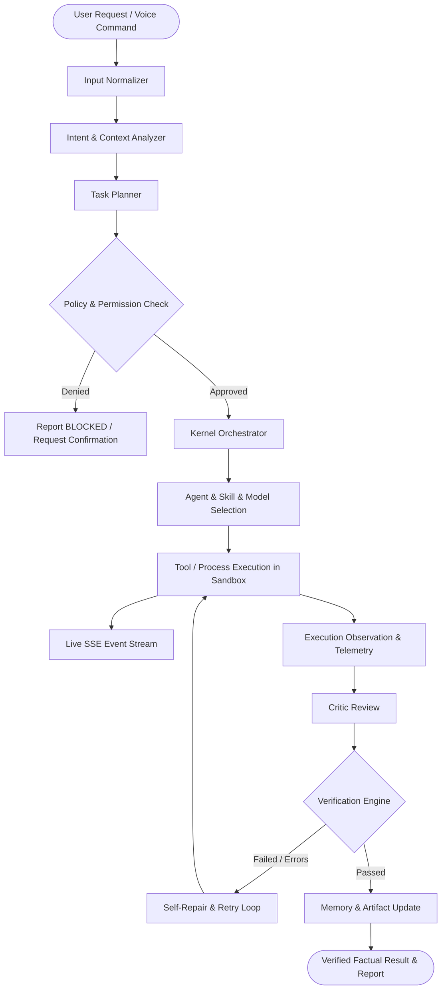

# J.A.R.V.I.S. MARK-V: Sovereign AI Operating System Architecture (V2)

**Version:** 5.0.0-PROD  
**Architect:** Antigravity Autonomous Engineering Agent  
**Standard:** Engineering Truth — The System Defines Truth, AI Recommends

---

## 1. Core Operating Principle

```
AI RECOMMENDS. THE EXECUTION KERNEL VALIDATES.
```

In J.A.R.V.I.S. Mark-V, an LLM never directly mutates state, claims task completion, or fabricates progress. Intelligence is strictly separated from execution:
- **The LLM** provides reasoning, intent decomposition, and action recommendations.
- **The Execution Kernel** enforces security policies, runs real software tools, tracks process execution, captures filesystem diffs, and computes factual verification.
- **The Event Stream** broadcasts live, observable atomic operations to the user interface.
- **The Verification Engine** gates task completion: a task is only marked `COMPLETED` when deterministic checks (compiler, linter, tests, or HTTP assertions) have verified the result.

---

## 2. Central Execution Pipeline



---

## 3. Persistent Task Engine & State Machine

Every user directive that requires non-trivial computation, file modifications, research, or multi-step execution becomes an immutable, persistent `Task` in SQLite.

### 3.1 Task States
```
CREATED -> QUEUED -> PLANNING -> ASSIGNED -> RUNNING -> WAITING_FOR_INPUT
                                     |           |
                                     |           v
                                     |---> RETRYING <---> BLOCKED
                                                 |
                                                 v
                                            VERIFYING
                                           /         \
                                          v           v
                                     COMPLETED      FAILED
                                                        \
                                                         v
                                                     CANCELLED
```

### 3.2 Task Data Schema
```typescript
interface TaskRecord {
  id: string;                     // cuid
  taskNumber: string;             // TASK-V5-XXXXX
  userRequest: string;            // Original raw prompt
  normalizedObjective: string;    // Clear, single-sentence objective
  parentTaskId?: string;          // Subtask hierarchy
  childTaskIds: string[];         // Subtasks
  assignedAgent: string;          // e.g., 'software_engineer', 'researcher'
  assignedSkill?: string;         // e.g., 'debug-typescript'
  assignedModel: string;          // Model ID used for execution
  priority: 'LOW' | 'NORMAL' | 'HIGH' | 'CRITICAL';
  status: TaskStatus;
  progress: number;               // 0 to 100 (computed from subtasks, not simulated)
  currentOperation: string;       // e.g., 'Applying search/replace diff to src/lib/api.ts'
  currentTool?: string;           // e.g., 'diff_patcher'
  etaRange: string;               // e.g., '02:00 - 04:30 min' (range-based)
  confidence: number;             // Measured execution confidence
  filesTouched: string[];         // Factual list of modified files
  commandsExecuted: string[];     // Actual shell commands executed
  errors: string[];               // Errors encountered during run
  retryCount: number;             // Number of automated retries
  verificationResult: string;     // Factual output of tests/compiler
  finalArtifacts: string[];       // References to produced artifacts
  failureReason?: string;
  createdAt: string;
  startedAt?: string;
  completedAt?: string;
  elapsedMs: number;
}
```

### 3.3 Range-Based ETA Engine
Exact completion times are never hallucinated. The ETA engine computes dynamic ranges based on:
$$\text{ETA}_{\text{range}} = \left[\sum \text{Subtasks Remaining} \times \bar{T}_{\text{tool}} \times 0.8, \;\; \sum \text{Subtasks Remaining} \times \bar{T}_{\text{tool}} \times 1.5 + T_{\text{cooldown}}\right]$$
Where:
- $\bar{T}_{\text{tool}}$ is the empirical rolling-average latency of invoked tools.
- $T_{\text{cooldown}}$ accounts for model latency and retry penalties.
- High-uncertainty tasks return wide ranges (e.g., `3–8 minutes`).
- Completed task durations are recorded in SQLite to continuously refine future estimates.

---

## 4. Real-Time Event System (SSE Stream)

The frontend connects to `GET /api/tasks/:id/stream` via Server-Sent Events (SSE). The execution kernel emits granular atomic events:

```typescript
type ExecutionEvent =
  | 'TASK_CREATED'       | 'TASK_PLANNED'       | 'TASK_ASSIGNED'
  | 'AGENT_STARTED'      | 'AGENT_THINKING'     | 'TOOL_STARTED'
  | 'TOOL_COMPLETED'     | 'BROWSER_STARTED'    | 'BROWSER_ACTION'
  | 'BROWSER_COMPLETED'  | 'COMMAND_STARTED'    | 'COMMAND_OUTPUT'
  | 'COMMAND_COMPLETED'  | 'FILE_READ'          | 'FILE_CREATED'
  | 'FILE_MODIFIED'      | 'FILE_DELETED'       | 'MODEL_STARTED'
  | 'MODEL_COMPLETED'    | 'RETRIEVAL_STARTED'  | 'RETRIEVAL_COMPLETED'
  | 'TEST_STARTED'       | 'TEST_COMPLETED'     | 'ERROR_DETECTED'
  | 'RECOVERY_STARTED'   | 'RECOVERY_COMPLETED' | 'VERIFICATION_STARTED'
  | 'VERIFICATION_PASSED'| 'VERIFICATION_FAILED'| 'TASK_COMPLETED'
  | 'TASK_FAILED'
```

Every event contains: `{ taskId, eventType, timestamp, message, metadata }`. The frontend displays the actual current operation and last completed action in real time.

---

## 5. Sovereign Core Agent Roster & Specialization

Rather than creating dozens of fictional agent personas, J.A.R.V.I.S. Mark-V maintains a lean team of **16 specialized agents** governed by the **Smallest Competent Team Principle**: only agents strictly required for the objective are activated.

```
                         [ J.A.R.V.I.S. ]
                   (Executive Orchestrator)
                             |
       +---------------------+---------------------+
       |                     |                     |
 [ ENGINEERING ]       [ RECON & OPS ]      [ SYSTEM & INTEL ]
 - ARCHITECT           - RESEARCHER         - SECURITY
 - SOFTWARE ENGINEER   - BROWSER AGENT      - MEMORY AGENT
 - FRONTEND ENGINEER   - AUTOMATION (n8n)   - EVOLUTION AGENT
 - BACKEND ENGINEER    - BUSINESS ANALYST   - CRITIC / VERIFIER
 - DATABASE ENGINEER   - DEVOPS
 - DEBUGGER (Self-Repair)
 - QA ENGINEER
```

### Dynamic Agent Foundry Guardrails
When a dynamic specialist is requested (e.g., *"Create an agent for Shopify Liquid debugging"*):
1. The Foundry synthesizes: Agent Definition, Capabilities, Tools, System Prompt, Memory Scope, Model Policy, and Permissions.
2. The agent is stored in SQLite under `agent_registry`.
3. **Security Gate:** Dynamic agents receive `SAFE_LOCAL` permissions by default; they can never receive `PRIVILEGED` or `PRODUCTION_WRITE` without explicit user confirmation.

---

## 6. Agentskills-Compatible Skill Architecture

A **Skill** is a modular, versioned capability defined as:
```
SKILL = Instructions + Tool Schemas + Execution Code + Verification Plan + Permissions
```

Directory structure:
```
skills/
└── <skill-name>/
    ├── manifest.json       # Metadata, version, permissions, triggers
    ├── INSTRUCTIONS.md     # Step-by-step reasoning instructions
    ├── tools.json          # Tool schemas exposed by this skill
    └── tests/              # Verification test suite for the skill
```

---

## 7. Model Abstraction & Intelligent Router

### 7.1 Provider-Neutral Interface
The model gateway abstracts multiple providers:
- **Local:** Ollama (Llama 3, DeepSeek-Coder, Qwen 2.5)
- **Free / Tier 1:** Gemini Flash (legitimate free quota)
- **Groq LPU:** Ultra-low latency LPU inference
- **OpenAI / Anthropic / OpenRouter:** Commercial fallbacks when configured

Every invocation records: `provider`, `model`, `latencyMs`, `inputTokens`, `outputTokens`, `estimatedCost`, `success`, and `error`.

### 7.2 Free-First / Local-First Routing Hierarchy
```
1. Local Model (Ollama)
   └── If offline or insufficient capacity:
2. Free Documented Provider Tier (Gemini Flash / Groq)
   └── If rate-limited or task requires high reasoning:
3. Low-Cost Cloud Model (DeepSeek R1 / Claude 3.5 Haiku)
   └── If task requires critical production architecture:
4. Flagship Model (Claude 3.5 Sonnet / GPT-4o) with explicit user policy
```

---

## 8. Real-Time Voice Pipeline Architecture

The voice architecture replaces browser SpeechRecognition and static MP3s with a continuous, streaming audio engine:

```
[ Microphone ]
      ↓
[ Voice Activity Detection (VAD) ] ── (Detects user speech / silence)
      ↓
[ Speech-to-Text (STT) ] ────────── (Transcribes spoken utterance)
      ↓
[ Intent Normalizer ] ───────────── (Extracts command or conversation)
      ↓
[ J.A.R.V.I.S. Core / Tools ] ────── (Runs kernel tool or answers)
      ↓
[ Streaming Text Response ]
      ↓
[ Non-Blocking Neural TTS ] ────── (Asynchronous edge-tts / streaming audio)
      ↓
[ Audio Player ] ────────────────── (Plays speech to speaker)
      ↑
(User Speaks) ─── Instant Barge-In / Interruption: Audio Player Immediately Cancels Active Buffer
```

---

## 9. Real Coding Agent (Aider & OpenHands Pattern)

The software engineer agent executes real repository modifications:
1. **Repo Map Construction:** Scans repository file paths and symbols; ranks relevant context.
2. **Read & Understand:** Reads exact files and lines needed.
3. **Surgical Diff Generation:** Generates unified diffs or exact search/replace chunks.
4. **Validation in Workspace:** Runs `npx tsc --noEmit` and relevant tests.
5. **Atomic Git Checkpointing:** If tests fail, it attempts automated repair (up to 3 retries). If repair fails, it reverts the git working tree cleanly.

---

## 10. Capability-Based Permissions & Sandbox Execution

### Execution Policies
- **`READ_ONLY`:** Inspect files, query read-only database views, web search.
- **`SAFE_LOCAL`:** Run linters, unit tests, write to `temp/` or scratch directories.
- **`PROJECT_WRITE`:** Create/edit files in the project workspace; runs compiler.
- **`SANDBOX`:** Run Python/Node scripts in an isolated process with strict resource and network limits.
- **`PRIVILEGED`:** Execute arbitrary shell commands, install packages.
- **`PRODUCTION`:** Cloud deployments, database migrations, deleting persistent data. **Requires explicit user confirmation.**

---

## 11. Multi-Layer Memory & RAG Architecture

```
WORKING MEMORY     (Active task blackboard & intermediate step artifacts)
CONVERSATION MEMORY(Recent session turns & context window)
EPISODIC MEMORY    (Log of past completed tasks, approaches, and duration metrics)
SEMANTIC MEMORY    (Stable facts, business rules, client info in SQLite)
PROJECT MEMORY     (Codebase structure, active dependencies, routes, conventions)
AGENT MEMORY       (Agent-specific skills and proven patterns)
FAILURE MEMORY     (Known failure modes, error messages, and verified fixes)
USER PREFERENCES   (Directives on communication style, tool preferences)
```

---

## 12. Self-Healing, Self-Evolution & Crash Recovery

### 12.1 Self-Repair Protocol
```
Runtime / Build Error
      ↓
[ Error Classifier ] ───────── (Extract error code, stack trace, and file target)
      ↓
[ Reproduce / Isolate ] ────── (Confirm error via test / compiler run)
      ↓
[ Root Cause Analysis ] ───── (Identify exact failing lines)
      ↓
[ Surgical Diff Generation ] ─ (Produce minimal fix)
      ↓
[ Sandbox / Test Run ] ─────── (Run test suite)
      ↓
[ Regression Check ] ───────── (Ensure no other tests broke)
      ↓
[ Verification Passed ] ────── (Commit fix and log Bug Fix Report)
```

### 12.2 Crash Recovery Engine
When the J.A.R.V.I.S. server starts up:
1. Query SQLite for tasks in `RUNNING`, `PLANNING`, or `VERIFYING` state.
2. For each interrupted task:
   - Mark state as `RECOVERING`.
   - Inspect git working tree and recent logs.
   - Re-evaluate task progress.
   - If clean: resume task from last recorded checkpoint.
   - If corrupted: log error, roll back unverified diffs, and notify user.
