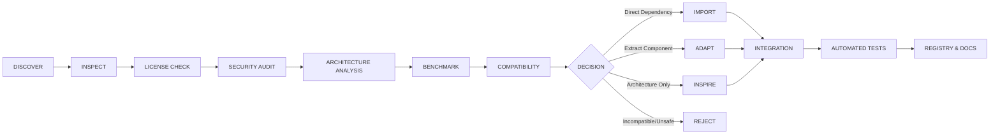

# J.A.R.V.I.S. MARK-V: Open-Source Intelligence & Assimilation Matrix

**Date:** October 2026  
**Auditor & Architect:** Antigravity Autonomous Engineering Agent  
**Standard:** Engineering Truth — Sovereign Capability Assimilation

---

## 1. Assimilation Engine Protocol

Every candidate open-source project evaluated for assimilation into J.A.R.V.I.S. Mark-V must pass the rigorous 11-step verification gate:

### The Four Decision Classifications
1. **IMPORT:** Package is clean, maintained, compatible, and can be imported directly as a dependency.
2. **ADAPT:** Core architecture or algorithm is excellent, but full package has excessive bloat or conflicting dependencies; extract and adapt the proven 20% pattern into clean TypeScript/Node.
3. **INSPIRE:** Study architecture, state machine, or data schema, but implement independently tailored to J.A.R.V.I.S. primitives.
4. **REJECT:** Redundant, obsolete, abandoned, permissive security risks, or framework bloat with poor capability-to-complexity ratio.

---

## 2. In-Depth Repository Forensic Analysis

### 2.1 FRIDAY (`SAGAR-TAMANG/friday-tony-stark-demo`)
- **License:** MIT | **Stars:** ~1,250
- **Purpose:** Tony Stark-inspired real-time voice assistant with FastMCP backend.
- **Key Architecture & Primitives:**
  - Decouples voice agent pipeline from tool execution using LiveKit Agents.
  - Exposes tools via FastMCP over SSE (Server-Sent Events).
  - Uses low-latency Gemini 2.5 Flash for conversational reasoning.
- **Security Audit:** High risk if system command tools lack execution boundaries.
- **Decision:** **ADAPT**
- **Assimilation Target for JARVIS:**
  - Extract the decoupled voice-agent and MCP SSE communication pattern.
  - Upgrade our voice pipeline from browser `SpeechRecognition` to streaming audio processing with strict tool authorization.

---

### 2.2 Agentic Command Center (`Forgemind-git/agentic-command-center`)
- **License:** Apache-2.0 | **Stars:** ~820
- **Purpose:** Claude-skill based AI command center orchestrating business operations and tools via MCP.
- **Key Architecture & Primitives:**
  - Single unified command plane orchestrating CRM, WhatsApp Business, data pipelines, and task routers.
  - Declarative MCP tool definitions with explicit input/output schemas.
  - Role-specific business operator personas.
- **Security Audit:** Requires isolation between external API credentials and client payloads.
- **Decision:** **ADAPT**
- **Assimilation Target for JARVIS:**
  - Adapt the unified command plane to replace unstructured API endpoints in `custom-routes.ts`.
  - Standardize all business and automation tools (Zoho, WhatsApp, n8n, CRM) under our MCP registry.

---

### 2.3 OpenHands / Software Agent SDK (`OpenHands/software-agent-sdk`)
- **License:** MIT | **Stars:** ~5,400
- **Purpose:** Modular SDK for building autonomous software engineering agents with real tool execution.
- **Key Architecture & Primitives:**
  - V1 stateless architecture: agent core decoupled from GUI/CLI runtime.
  - Clean `Observation -> Action -> Verification` cycle.
  - Real toolset: Bash sandboxing, file editing, AST exploration, and test execution.
- **Security Audit:** Host execution requires isolation (path containment and safe execution policies).
- **Decision:** **ADAPT**
- **Assimilation Target for JARVIS:**
  - Completely replace the mock `OpenHandsAgent.ts` with a real workspace software engineering loop.
  - Implement real file inspection, surgical diff generation, compiler checking (`tsc`), and test runner verification.

---

### 2.4 Aider (`Aider-AI/aider`)
- **License:** Apache-2.0 | **Stars:** ~32,000
- **Purpose:** Leaderboard-topping autonomous AI pair programming tool.
- **Key Architecture & Primitives:**
  - **Repo-Map:** Builds a concise structural map of the entire codebase using tree-sitter symbol graphs and PageRank.
  - **Surgical Diff Editing:** Prompts model for minimal unified diffs or search/replace blocks; validates and applies diffs deterministically.
  - **Git Checkpoints:** Automatically commits before changes; tests compiler output; rolls back instantly if tests fail.
- **Security Audit:** Must restrict edits to the project directory to prevent path traversal.
- **Decision:** **ADAPT**
- **Assimilation Target for JARVIS:**
  - Upgrade our `codebaseMemory.ts` with Aider's repo-map ranking.
  - Implement Aider's search/replace diff application with atomic git rollbacks on failed verification.

---

### 2.5 Browser-Use (`browser-use/browser-use`)
- **License:** MIT | **Stars:** ~29,000
- **Purpose:** Autonomous web browser agent using Playwright and Chrome DevTools Protocol (CDP).
- **Key Architecture & Primitives:**
  - Extracts interactive DOM trees with indexed bounding boxes.
  - Real browser interactions: clicking coordinates, typing, scrolling, file uploading, and navigating.
  - Visual verification via screenshots.
- **Security Audit:** High prompt-injection vulnerability from untrusted web page text. Web content must be strictly treated as untrusted DATA, never as executable instructions.
- **Decision:** **ADAPT**
- **Assimilation Target for JARVIS:**
  - Replace the fake `BrowserUseScraper.ts` regex fetcher with a real headless browser agent (Playwright / Chrome DevTools MCP).
  - Implement DOM element indexing, interactive navigation, and screenshot verification.

---

### 2.6 LangGraph (`langchain-ai/langgraph`)
- **License:** MIT | **Stars:** ~19,500
- **Purpose:** Stateful cyclical multi-agent graph orchestration framework.
- **Key Architecture & Primitives:**
  - Cyclical state machine with durable checkpoints.
  - Conditional edge branching based on verification outputs.
  - Human-in-the-loop interruption and resumption.
- **Security Audit:** Ensure state checkpoint serialization is safe against code injection.
- **Decision:** **INSPIRE**
- **Assimilation Target for JARVIS:**
  - Study LangGraph's cyclical state model and checkpointing, but do NOT import the heavy LangChain dependency suite.
  - Build a lightweight, native TypeScript cyclical workflow kernel (Planner -> Specialist -> Critic -> Verifier).

---

### 2.7 PydanticAI (`pydantic/pydantic-ai`)
- **License:** MIT | **Stars:** ~9,200
- **Purpose:** Fast, type-safe agent framework with strict schema validation and model neutrality.
- **Key Architecture & Primitives:**
  - Strict input/output schema enforcement: system defines truth, LLM conforms or fails.
  - Clean dependency injection and isolated execution contexts.
  - Model neutrality across local Ollama, Groq, OpenAI, Gemini, and Anthropic.
- **Security Audit:** Schema validation acts as an input sanitizer against malformed agent payloads.
- **Decision:** **INSPIRE**
- **Assimilation Target for JARVIS:**
  - Port PydanticAI's schema validation principles into TypeScript using Zod/TypeScript types for every tool and agent action.

---

### 2.8 Langfuse (`langfuse/langfuse`)
- **License:** MIT / FSL-1.1-Apache-2.0 | **Stars:** ~11,500
- **Purpose:** Open-source LLM observability, tracing, metrics, and evaluation platform.
- **Key Architecture & Primitives:**
  - Hierarchical trace trees (`Task -> Step -> Agent -> Tool -> Model`).
  - Granular latency, token consumption, and dollar cost tracking.
  - Error detection, retry counts, and user feedback tagging (👍 / 👎 / corrections).
- **Security Audit:** Telemetry must redact sensitive API keys and secrets.
- **Decision:** **ADAPT**
- **Assimilation Target for JARVIS:**
  - Implement an in-memory & SQLite-persisted hierarchical trace engine modeled on Langfuse.
  - Expose trace trees directly on the frontend execution cockpit.

---

### 2.9 LiveKit Agents (`livekit/agents`)
- **License:** Apache-2.0 | **Stars:** ~6,300
- **Purpose:** Real-time multi-modal voice agent orchestration framework.
- **Key Architecture & Primitives:**
  - Voice Activity Detection (VAD) with millisecond silence detection.
  - Instant barge-in / interruption: cancels active speech audio buffers immediately when the user starts speaking.
  - Low-latency streaming STT -> LLM streaming -> streaming TTS.
- **Security Audit:** Audio streaming sessions must use authenticated tokens.
- **Decision:** **ADAPT**
- **Assimilation Target for JARVIS:**
  - Upgrade JARVIS voice engine to handle instant interruption, non-blocking asynchronous audio generation, and distinct multi-agent voices without blocking the Node server.

---

### 2.10 NousResearch Hermes Agent (`NousResearch/hermes-agent`)
- **License:** Apache-2.0 | **Stars:** ~4,100
- **Purpose:** Self-improving autonomous agent with persistent memory and DSPy-based prompt evolution.
- **Key Architecture & Primitives:**
  - Autonomous self-evolution loop: Observe failure -> Isolate pattern -> Formulate candidate prompt -> Sandbox test -> Deploy.
  - Structured XML/Markdown tool-use conventions.
- **Security Audit:** Never allow autonomous self-evolution to modify core security guardrails without explicit human confirmation.
- **Decision:** **ADAPT**
- **Assimilation Target for JARVIS:**
  - Replace the mock `selfEvolution.ts` with a real failure-pattern learning loop that benchmarks prompt optimizations in a test harness before activating them.

---

### 2.11 OpenJarvis (`open-jarvis/OpenJarvis`)
- **License:** MIT | **Stars:** ~3,400
- **Purpose:** Local-first, privacy-conscious voice AI assistant framework.
- **Key Architecture & Primitives:**
  - Local-first model routing: prioritizes local Ollama / free-tier models before calling paid commercial APIs.
  - SQLite persistence for durable conversation and task state.
- **Security Audit:** Keeps private data on the local machine unless explicitly routed to cloud models.
- **Decision:** **ADAPT**
- **Assimilation Target for JARVIS:**
  - Enforce the Free-First / Local-First routing policy across our Model Router.

---

### 2.12 OpenClaw (`openclaw/openclaw`)
- **License:** MIT | **Stars:** ~2,100
- **Purpose:** Composable skill extensions and local agent workspace management.
- **Key Architecture & Primitives:**
  - Agentskills-compatible format: manifest + instructions + tools + verification + metadata.
  - Workspace memory scoping per agent.
- **Security Audit:** Skills must be statically analyzed before registration.
- **Decision:** **ADAPT**
- **Assimilation Target for JARVIS:**
  - Adopt a standardized skill directory structure (`skills/<skill_name>/manifest.json`) for local and discovered skills.

---

## 3. Engineering Primitives Assimilation Roadmap

| Primitive Domain | Current JARVIS Status | Best-in-Class Reference | Mark-V Assimilation Strategy |
| :--- | :--- | :--- | :--- |
| **Execution Kernel** | MOCK (direct route-to-LLM text) | OpenHands SDK + LangGraph | Build centralized kernel with state machine and verification |
| **Coding Agent** | MOCK (`OpenHandsAgent.ts`) | Aider + OpenHands | Implement repo-map, AST search, search/replace diffs, `tsc` check |
| **Browser Agent** | PARTIAL (`BrowserUseScraper.ts` regex fetch) | Browser-Use + Playwright | Playwright browser automation with interactive DOM indexing |
| **Voice Engine** | PARTIAL (browser speech + canned MP3s) | LiveKit Agents + FRIDAY | Non-blocking async TTS, VAD, barge-in cancellation, edge-tts |
| **Task / Event Bus** | PARTIAL (mock step percentages) | Langfuse + Temporal | Atomic task events (`TASK_*`, `TOOL_*`, `FILE_*`), live SSE streaming |
| **Tool / MCP System**| PARTIAL (unsandboxed host exec) | Agentic Command Center + FastMCP | Strict MCP schemas, capability permissions, timeouts, sandboxing |
| **Model Router** | PARTIAL (cooldown array) | OpenJarvis + LiteLLM | Free/Local-first routing, measured latency/cost scorecard |
| **Self-Repair** | MOCK (claims 0 errors blindly) | ECC Build Error Resolver | Diagnose -> Surgical Diff -> Test -> Regression Check -> Report |
| **Self-Evolution** | MOCK (`Math.random()` in localStorage) | Hermes Agent + DSPy | Scout -> Sandbox Test -> Security Audit -> Human Approval |
| **Observability** | MOCK / None | Langfuse | Full hierarchical trace tree with tokens, latency, cost, and errors |
